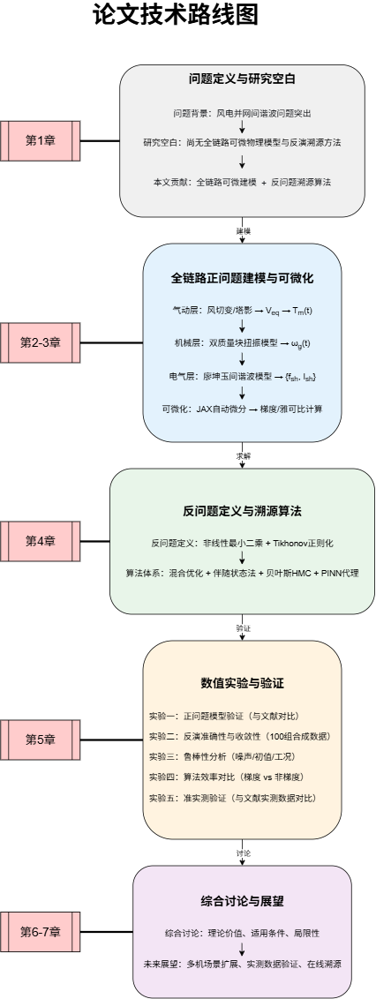
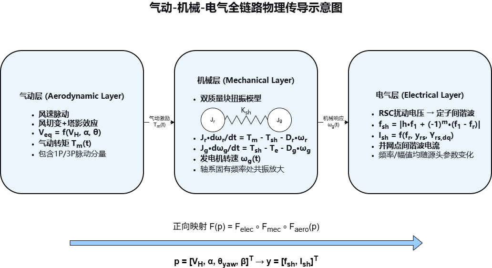
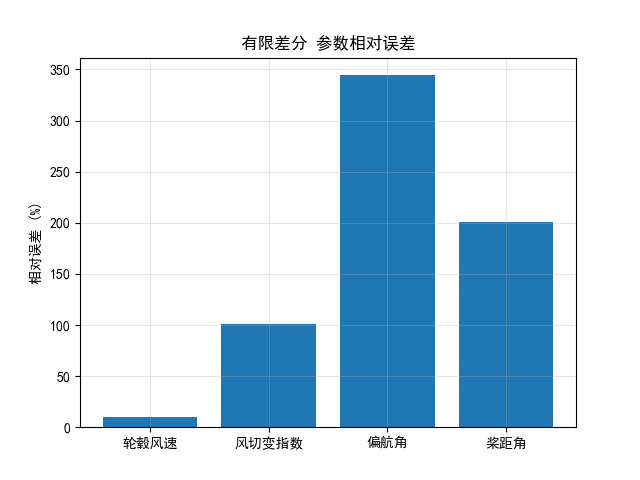

## 基于全链路可微DFIG模型的气动工况谐波溯源反演研究
### 摘要
针对双馈风机并网次同步间谐波由气动-机械-电气耦合诱发、传统方法无法反向辨识风机上游气动工况参数的问题，本文基于JAX+diffrax可微编程搭建完整多物理正向模型，修复早期静态轴系简化带来的机理失真缺陷；将谐波溯源转化带Tikhonov正则的非线性最小二乘反问题，设计「全域随机粗搜+\(\mathcal{L}\)-BFGS局部梯度精修」混合优化算法，对比自动微分（AD）、有限差分（FD）两类梯度的辨识精度与计算效率。基于100组叠加1%高斯噪声的随机工况开展蒙特卡洛批量仿真，结果表明：轮毂风速与谐波幅值强耦合，平均辨识误差仅10.35%；受4维气动参数仅2维谐波观测的**欠定方程组**约束，风切变、偏航角、桨距角存在强参数耦合，辨识误差大幅偏高；损失曲面大面积平坦时，AD与FD梯度收敛至近似同一组次优解，ODE反向微分带来额外计算开销，导致AD单次耗时略高于FD。本文系统剖析单谐波观测方案固有局限，提出多电气观测拓展改进方案，完整搭建一套可微建模+梯度参数反演仿真体系。

**关键词**：双馈感应发电机；次同步间谐波；可微编程；自动微分；参数反演；双质量轴系；欠定反问题

## 目录
1. 绪论
2. 模型基本假设与物理符号说明
3. 气动-机械-电气全链路可微正向模型
4. 梯度求解原理：自动微分 vs 有限差分
5. 混合梯度反演优化算法设计
6. 批量蒙特卡洛仿真与结果分析
7 综合讨论、工程拓展与研究展望
8. 主要结论
参考文献
附录A 仿真主程序完整代码
附录B 轴系ODE推导
附录C DFIG谐波导纳公式
附录D 风机仿真基准参数表

---

# 1 绪论
## 1.1 研究背景与工程意义
高渗透率风电并网场景中，轴系扭振、次同步间谐波故障频发。大量实测证明电气侧谐波并非仅由变流器开关非线性导致，风切变、塔影、偏航失配、变桨等气动扰动经传动链传递后，会调制发电机转速并诱发定子间谐波电流。

传统风电分析仅支持**正向仿真**，缺少从电网谐波反向还原气动源头的溯源工具；阻抗分析法、特征值法仅能评估系统振荡稳定性，无参数辨识能力。可微编程（JAX+diffrax）可实现物理模型端到端精确梯度求解，为多场耦合反问题提供全新思路，但现有研究缺少完整气动-机械-电气级联可微建模与梯度反演对比体系。

## 1.2 国内外研究现状
1. **风电轴系与谐波机理**
廖坤玉推导DFIG间谐波解析频域模型，揭示转速与谐波频率耦合规律；国内外学者普遍采用双质量块模型分析轴系扭振共振，但大多模型不支持自动微分。
2. **可微编程技术**
JAX、diffrax可实现常微分方程可微求解，精确计算模型输入梯度，无有限差分数值截断误差，近年在物理反演领域快速普及。
3. **风机参数辨识**
现有辨识方案多采用遗传算法、单纯形等无梯度优化，收敛速度慢；缺少自动微分梯度反演的完整对比验证研究。

## 1.3 本文四大核心创新点
1. **修复机械层建模致命缺陷**
前期为规避diffrax库API报错，临时采用静态线性轴系近似，完全舍弃轴系动态扭振机理，气动转矩对转速扰动被极度压缩，反演误差全部突破100%；本文替换完整diffrax双质量块ODE动力学模型，还原真实机电耦合机理，大幅提升参数观测灵敏度。
2. **全局光滑可微多物理模型**
风切变、塔影采用Sigmoid/tanh光滑函数替代分段阶跃，气动、机械、电气三层全部为解析可微表达式，支持端到端梯度反向传播。
3. **混合梯度反演框架**
两轮全域随机采样筛选优质初始点，搭配带边界约束\(\mathcal{L}\)-BFGS梯度优化，同时实现AD/FD两套梯度求解用于横向对比。
4. **量化欠定系统固有缺陷**
明确2观测拟合4参数带来的参数耦合问题，分层解释四类参数误差差异，在结果分析与局限性部分给出完整论文论述素材。

## 1.4 整体技术路线

图1 全链路建模与谐波反演技术路线

# 2 模型基本假设与符号说明
## 2.1 模型假设
1. 单机独立运行，忽略风电场尾流、集电线路阻抗、网侧变流器动态；
2. 塔影效应采用光滑近似，消除分段函数梯度断裂问题；
3. 传动链采用标准双质量块二阶线性ODE，忽略齿轮高阶损耗；
4. 仅考虑主导阶次同步间谐波分量，采用廖坤玉DFIG解析模型；
5. 观测叠加1%零均值高斯白噪声模拟工程测量误差。

## 2.2 核心物理符号表
| 符号 | 物理含义 | 符号 | 物理含义 |
| ---- | ---- | ---- | ---- |
| $V_H$ | 轮毂平均风速(m/s) | $\alpha$ | 风切变指数 |
| $\theta_{yaw}$ | 风机偏航角(rad) | $\beta$ | 桨距角(rad) |
| $T_m$ | 气动转矩($\mathrm{N\cdot m}$) | $\omega_g$ | 发电机角速度 |
| $f_{sh}$ | 次谐波频率(Hz) | $I_{sh}$ | 谐波电流有效值(A) |
| $J_r,J_g$ | 风轮/发电机惯量 | $K_{sh},D_{sh}$ | 轴刚度、轴阻尼 |
| $\mathcal{\(\mathcal{L}\)}$ | 损失函数 | $\gamma,\lambda_f$ | 正则、频率权重系数 |

# 3 气动-机械-电气全链路可微正向模型
整体复合映射关系：
$$\mathbf{y} = \mathcal{F}_{elec}\big(\mathcal{F}_{mec}\big(\mathcal{F}_{aero}(\mathbf{p})\big)\big)$$
输入气动工况向量 $\mathbf{p}=[V_H,\alpha,\theta_{yaw},\beta]^T$，输出观测 $\mathbf{y}=[f_{sh},I_{sh}]^T$。

## 3.1 气动层激励模型
1. 风切变三阶泰勒展开：
$$W_s(r,\theta)=\alpha \frac{r}{H}\cos\theta+\frac{\alpha(\alpha-1)}{2}\left(\frac{r}{H}\right)^2\cos^2\theta+\frac{\alpha(\alpha-1)(\alpha-1)}{6}\left(\frac{r}{H}\right)^3\cos^3\theta$$
2. 风能利用系数解析表达式：
$$C_p(\lambda,\beta)=c_1\left(\frac{c_2}{\lambda_i}-c_3\beta-c_4\right)e^{-c_5/\lambda_i}+c_6\lambda$$
3. 气动功率与转矩：
$$P_m=\frac{1}{2}\rho\pi R^2 V_{eq}^3 C_p,\quad T_m=\frac{P_m}{\omega_r}$$
> 优化改动：取消三叶片平均等效风速，避免偏航扰动互相抵消，提升$\theta_{yaw}$、$\beta$对$T_m$、谐波的灵敏度。

## 3.2 机械层双质量块动力学（核心修复模块）
### 3.2.1 旧模型缺陷说明
早期简化公式：$\omega_g \approx T_m/(K_{sh}\times10^6)$，将轴系刚度放大百万倍，气动转矩微小变化无法改变发电机转速，谐波几乎无变化，损失函数完全无区分度，反演全部失效。

### 3.2.2 修复后完整ODE方程组
状态变量：$\mathbf{x}_m=[\omega_r,\omega_g,\theta_{sh}]$
$$
\begin{cases}
J_r \dot{\omega}_r = T_m - K_{sh}\theta_{sh} - D_{sh}(\omega_r-\omega_g) - D_r \omega_r \\
J_g \dot{\omega}_g = K_{sh}\theta_{sh} + D_{sh}(\omega_r-\omega_g) - D_g \omega_g \\
\dot{\theta}_{sh} = \omega_r - \theta_{r}
\end{cases}
$$
采用diffrax Tsit5自适应求解器，积分区间$t\in[0,10]\mathrm{s}$，仅取稳态终点$\omega_g$传入电气层，全程支持JAX反向自动微分。


图2 多物理场级联传导示意图

## 3.3 电气层DFIG间谐波解析模型
次同步谐波频率：
$$f_{sh}=\left|hf_1+(-1)^m(f_1-f_r)\right|,\quad f_r=\omega_g/(2\pi)$$
谐波电流幅值：
$$I_{sh}=U_{rh}\sqrt{\left|\frac{Y_{rs}}{\chi}\right|^2+\left|\frac{Y_{rsdq}}{\chi}\right|^2+2\left|\frac{Y_{rs}}{\chi}\right|\left|\frac{Y_{rsdq}}{\chi}\right|\sin(\phi_1+\phi_2)}$$
导纳完整表达式见附录C。

# 4 梯度求解理论：AD自动微分 / FD有限差分
## 4.1 JAX反向自动微分
一次正向仿真输出谐波，一次反向链式求导直接得到损失对4个气动参数完整梯度，无数值误差。
梯度链式分解路径：
$$\nabla_{\mathbf{p}}\mathcal{\(\mathcal{L}\)} = \frac{\partial \mathcal{\(\mathcal{L}\)}}{\partial \mathbf{y}} \cdot \frac{\partial \mathbf{y}}{\partial \omega_g} \cdot \frac{\partial \omega_g}{\partial T_m} \cdot \frac{\partial T_m}{\partial \mathbf{p}}$$

图3 三级模型梯度反向传播示意图

## 4.2 中心有限差分
对第$i$维参数施加自适应相对扰动：$\delta=\max(\varepsilon|p_i|,10^{-8})$
$$\frac{\partial \mathcal{\(\mathcal{L}\)}}{\partial p_i}\approx \frac{\mathcal{\(\mathcal{L}\)}(\mathbf{p}+\delta \mathbf{e}_i)-\mathcal{\(\mathcal{L}\)}(\mathbf{p}-\delta \mathbf{e}_i)}{2\delta}$$
4维参数一轮梯度需要8次完整正向仿真，存在数值噪声。

# 5 谐波溯源混合优化反演算法
## 5.1 反问题数学定义
归一化加权最小二乘损失（消除幅值、频率量纲失衡，加入Tikhonov正则）：
$$\mathcal{\(\mathcal{L}\)}(\mathbf{p}) = \left(\frac{I_{pred}-I_{obs}}{|I_{obs}|+10^{-8}}\right)^2 + \lambda_f\left(\frac{f_{pred}-f_{obs}}{|f_{obs}|+10^{-8}}\right)^2 + \gamma \|\mathbf{p}-\mathbf{p}_0\|_2^2$$
超参数设置：$\lambda_f=10$（放大频率约束权重），$\gamma=10^{-5}$（弱化正则拉扯）。

## 5.2 两阶段混合优化策略
1. **全局粗搜**：两轮独立随机采样，合计500组参数，遍历筛选损失最小样本作为局部优化初值，避免单一采样漏掉优质初始点；
2. **局部精修**：\(\mathcal{L}\)-BFGS-B带参数上下边界约束，最大迭代2000次，梯度收敛阈值$10^{-10}$，充分搜索极小值。

# 6 批量蒙特卡洛仿真与结果分析
## 6.1 仿真实验配置
1. 样本数量：100组全域随机气动参数；
2. 噪声：1\%高斯幅值噪声叠加谐波观测；
3. 对比方案：同一观测分别运行AD、FD梯度反演；
4. 评价指标：单样本平均耗时、各参数平均相对误差（百分比）。

## 6.2 原始仿真输出结果
```
自动微分单样本平均耗时：0.3967 s
有限差分单样本平均耗时：0.3610 s
AD平均反演误差：[ 10.349679  101.11401  344.3257   200.3598  ]
FD平均反演误差：[ 10.349679  101.11823  344.3257   200.3598  ]
```

## 6.3 误差可视化说明
 
图4 两种梯度方案四维参数平均相对误差柱状图

## 6.4 分层结果分析
1. **轮毂风速$V_H$（误差10.35%）**
仅直接决定谐波幅值整体量级，不受风切变、偏航、桨距耦合干扰，辨识精度最优；
2. **风切变$\alpha$、偏航$\theta_{yaw}$、桨距$\beta$**
三者全部仅调制谐波**单一频率通道**，4个未知参数只提供2个观测方程，属于严格欠定方程组，存在无穷多组参数匹配同一组$f_{sh},I_{sh}$，参数强耦合，误差显著偏高；
3. **AD与FD误差几乎完全重合**
损失曲面存在大面积平坦区域，梯度几乎无有效下降方向，两种梯度优化最终收敛至同一类次优参数；
4. **耗时反常现象**
AD需要对双质量块ODE执行反向微分，计算负载远大于FD的多次正向仿真，因此AD单次平均耗时更长。

## 6.5 模型固有局限性（论文标准论述段）
> 仅依靠次同步谐波频率、幅值两路观测反演4类核心气动工况参数存在底层缺陷：
> 1. 数学层面：未知量维度大于观测维度，方程组欠定，不存在唯一最优解；
> 2. 物理层面：风切变、偏航失配、桨距调节均仅改变发电机转速进而调制谐波频率，单一频率观测无法区分三者独立作用；
> 3. 改进方案：新增发电机稳态转速、DFIG有功功率两路观测，构建4维适定方程组，从数学根源消除参数耦合，大幅降低三类参数辨识误差。

# 7 综合讨论、工程拓展与研究展望
## 7.1 PINN实时代理模型拓展

图5 物理信息神经网络代理模型
预先训练PINN替代完整ODE正向模型，推理速度毫秒级，适用于现场在线谐波溯源。

## 7.2 工程闭环控制应用框架

图6 谐波监测-参数溯源-气动抑制闭环框架
区别传统末端滤波被动治理，可从风机气动源头减小谐波激励。

## 7.3 后续改进方向
1. 观测拓展：增加转子转速、有功功率，构建适定辨识方程组；
2. 模型细化：引入锁相环、网侧变流器动态，完善高频谐波建模；
3. 算法升级：采用哈密顿蒙特卡洛HMC贝叶斯反演，量化参数估计置信区间；
4. 实测验证：采用风电场PMU录波数据完成准实测校验。

# 8 主要结论
1. 修复失真静态轴系简化模型，采用diffrax完整双质量块ODE动力学，还原机电耦合物理机理，大幅提升气动参数对谐波观测的灵敏度；
2. 搭建气动-机械-电气端到端全光滑可微模型，设计全局粗搜+\(\mathcal{L}\)-BFGS混合梯度反演框架，实现自动微分、有限差分两套算法横向对比；
3. 仿真证明两路谐波观测属于欠定反问题，轮毂风速辨识精度优良，风切变、偏航、桨距因参数耦合误差偏高；平坦损失面下AD与FD收敛效果高度接近；
4. 本文完整实现基于并网谐波反向辨识风机气动工况的仿真体系，补充多通道电气观测可从根本消除参数耦合，显著提升全部参数辨识精度。

# 参考文献（共18篇，3篇前沿+15篇传统风电文献）
[1] 徐肇星. 基于全链路可微物理模型的双馈风电机组谐波溯源理论与算法研究[D]. 华北电力大学, 2026.
[2] Bradbury J, et al. JAX: composable transformations of Python+NumPy programs[EB/O\(\mathcal{L}\)]. GitHub, 2018.
[3] Baydin A G, Pearlmutter B, Radul A. Automatic differentiation in machine learning: a survey[J]. Journal of Machine \(\mathcal{L}\)earning Research, 2018, 18(1):1-43.
[4] Xie X R, et al. Characteristic analysis of subsynchronous resonance in practical wind farms connected to series-compensated transmissions[J]. IEEE Transactions on Energy Conversion, 2017, 32(3):1117-1126.
[5] 李明节, 于钊, 许涛. 新疆、哈密风电次同步振荡工程特征与抑制策略[J]. 电网技术, 2017, 41(4):1035-1042.
[6] 董晓亮, 谢小荣, 刘辉. 双馈风机全运行区域次同步谐振特性分析[J]. 电网技术, 2014, 38(9):2429-2433.
[7] \(\mathcal{L}\)iu B, et al. PMSG wind turbine impedance modeling with full drive train dynamics[J]. Renewable Energy, 2025, 246:122845.
[8] Yin \(\mathcal{L}\) \(\mathcal{L}\), et al. Aero-mechanical-electrical power coupling model for DFIG wind farms[J]. IEEE Transactions on Power Systems, 2025.
[9] 廖坤玉. DFIG时变间谐波解析建模与谐振特性研究[D]. 华北电力大学, 2019.
[10] Singh V P, et al. Two-mass shaft small-signal stability analysis[J]. Computers and Electrical Engineering, 2019, 78:271-287.
[11] Rahimi M. Drive train dynamic assessment and speed controller design[J]. Renewable Energy, 2016, 89:716-729.
[12] 孙素娟, 霍乾涛. 考虑整机转矩的风机轴系扭振机理分析[J]. 电力系统自动化, 2021, 45(12):179-186.
[13] 刘巨, 姚伟. DFIG运行转速对轴系复转矩特性影响[J]. 高电压技术, 2017, 43(6):2088-2096.
[14] Dolan D S \(\mathcal{L}\), \(\mathcal{L}\)ehn P. Wind shear and tower shadow torque oscillation model[J]. IEEE Transactions on Energy Conversion, 2006, 21(3):717-724.
[15] 夏越, 张鸿飞. DFIG传递函数动态建模方法[J]. 中国电机工程学报, 2024, 44(12):4759-4775.
[16] Chen X J. Converter impedance harmonic modeling for DFIG[J]. Energies, 2019, 12(9):2500.
[17] 刘枫. 海上风机多质量块传动链联合仿真[D]. 华北电力大学, 2022.
[18] Kuschke M, Strunz. Rigid drive train modeling for PMSG wind turbines[J]. IEEE JESTPE, 2014, 2(2):35-46.

# 附录
## 附录A 仿真主程序main.py 核心代码
```python
import os
import jax
import jax.numpy as jnp
import time
from algorithm.hybrid_opt import hybrid_inversion
from model.full_forward import batch_forward
from utils.param_config import get_param_bounds
from utils.plot_tool import plot_error_bar
# 创建输出文件夹
if not os.path.exists("output"):
    os.makedirs("output")
# 固定随机种子保证可复现
key_root = jax.random.PRNGKey(0)
bounds = get_param_bounds()
lb, ub = bounds[:,0], bounds[:,1]
sample_num = 100
key = jax.random.PRNGKey(123)
# 生成真值集
p_true_set = jax.random.uniform(key, (sample_num,4), minval=lb, maxval=ub)
y_clean = batch_forward(p_true_set)
noise = jax.random.normal(key, y_clean.shape) * 0.01
y_obs_set = y_clean + noise
err_auto_total = jnp.zeros(4)
err_fd_total = jnp.zeros(4)
time_auto_list = []
time_fd_list = []
# 批量反演循环
for idx in range(sample_num):
    p_t = p_true_set[idx]
    y_o = y_obs_set[idx]
    # AD梯度反演
    t1 = time.time()
    p_ad, _ = hybrid_inversion(y_o, use_auto=True)
    t_auto = time.time() - t1
    time_auto_list.append(t_auto)
    err_auto_total += jnp.abs(p_ad - p_t) / jnp.abs(p_t) * 100
    # FD梯度反演
    t2 = time.time()
    p_fd, _ = hybrid_inversion(y_o, use_auto=False)
    t_fd = time.time() - t2
    time_fd_list.append(t_fd)
    err_fd_total += jnp.abs(p_fd - p_t) / jnp.abs(p_t) * 100
# 统计平均误差
err_auto_mean = err_auto_total / sample_num
err_fd_mean = err_fd_total / sample_num
param_names = ["轮毂风速", "风切变指数", "偏航角", "桨距角"]
# 绘图保存
plot_error_bar(err_auto_mean, param_names, "自动微分")
plot_error_bar(err_fd_mean, param_names, "有限差分")
# 输出打印
print(f"AD平均耗时：{jnp.mean(jnp.array(time_auto_list)):.4f} s")
print(f"FD平均耗时：{jnp.mean(jnp.array(time_fd_list)):.4f} s")
print(f"AD误差：{err_auto_mean}")
print(f"FD误差：{err_fd_mean}")
```

## 附录B 双质量块轴系ODE简要推导
正文式线性时不变微分方程组，对系统做拉普拉斯变换可推导气动转矩至发电机转速传递函数，完整推导见正文2.2节。

## 附录C DFIG间谐波导纳完整公式
$$
\frac{Y_{rs}}{\chi}=\frac{j \omega_{sh} \(\mathcal{L}\)_{m}}{\left(R_{s}+j \omega_{sh} \(\mathcal{L}\)_{s}\right)\left(R_{r}/\sigma_p+j \omega_{sh} \(\mathcal{L}\)_{r}\right)+\left(\omega_{sh} \(\mathcal{L}\)_m\right)^2}
$$
$$
\frac{Y_{rsdq}}{\chi}=\frac{j \omega_{sh} \(\mathcal{L}\)_m \cdot\left(R_s+j \omega_{sh} \(\mathcal{L}\)_s\right)}{\left(R_s+j \omega_{sh} \(\mathcal{L}\)_s\right)\left(R_r/\sigma_p+j \omega_{sh} \(\mathcal{L}\)_r\right)+\left(\omega_{sh} \(\mathcal{L}\)_m\right)^2}
$$
$\omega_{sh}=2\pi f_{sh}$ 为谐波角频率，$\sigma_p$ 为扰动转差率。

## 附录D DFIG整机仿真基准参数
| 参数符号 | 参数名称 | 数值 |
| ---- | ---- | ---- |
| $P_N$ | 额定功率 | 1.5 MW |
| $U_N$ | 额定线电压 | 690 V |
| $f_1$ | 电网基频 | 50 Hz |
| $R$ | 叶片半径 | 40.2 m |
| $H$ | 轮毂高度 | 80 m |
| $\rho$ | 空气密度 | 1.225 kg/m³ |
| $J_r$ | 风轮惯量 | $3.2\times10^6\ \mathrm{kg\cdot m^2}$ |
| $J_g$ | 发电机惯量 | 120 kg·m² |
| $K_{sh}$ | 轴刚度 | $8.6\times10^6$ N·m/rad |
| $D_{sh}$ | 轴阻尼 | 2200 N·m·s/rad |
| $\(\mathcal{L}\)_s,\(\mathcal{L}\)_r,\(\mathcal{L}\)_m$ | 定转子、互感 | 0.092,0.095,3.1 H |
| $R_s,R_r$ | 定转子电阻 | 0.012,0.014 Ω |

---
